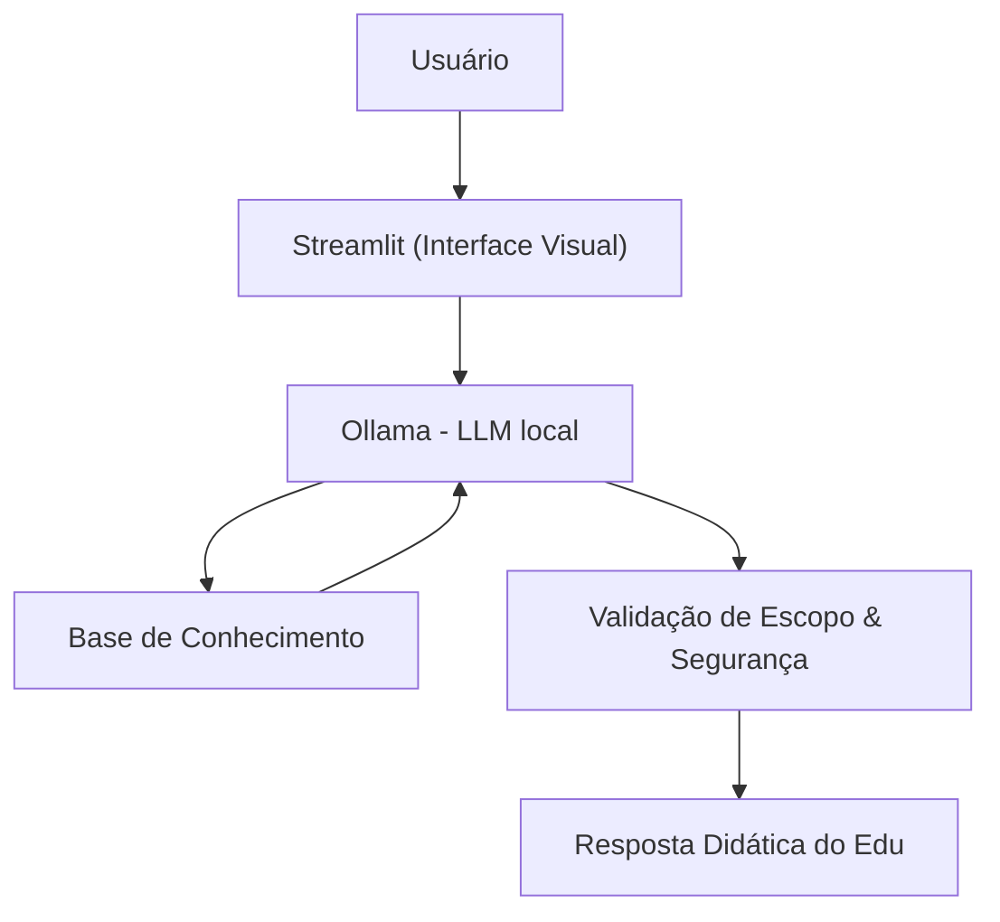

# 🎓 Edu - Educador Financeiro Inteligente

O **Edu** é um agente de inteligência artificial de perfil puramente consultivo e educacional, desenvolvido para desmistificar o universo das finanças pessoais. Ele traduz termos técnicos do mercado financeiro de forma didática, amigável e acessível, utilizando os dados reais do próprio usuário para contextualizar explicações práticas e personalizadas.

---

## 🛠️ Arquitetura e Funcionamento

O projeto integra uma interface interativa baseada em **Streamlit** com processamento local através do **Ollama** utilizando o modelo `gpt-oss`, consumindo bases de dados mockadas em formatos JSON e CSV para alimentar o contexto do cliente.



Para mais detalhes sobre a arquitetura e diretrizes de design do agente, consulte a [Documentação do Agente](./docs/01-documentacao-agente.md).

---

## 📂 Estrutura de Arquivos e Documentação

```
📁 dio-lab-bia-do-futuro-agente-financeiro/
│
├── 📄 README.md                      # Documento principal explicativo do projeto
│
├── 📁 data/                          # Dados mockados para o agente
│   ├── historico_atendimento.csv     # Histórico de atendimentos (CSV)
│   ├── perfil_investidor.json        # Perfil do cliente (JSON)
│   ├── produtos_financeiros.json     # Produtos disponíveis (JSON)
│   └── transacoes.csv                # Histórico de transações (CSV)
│
├── 📁 docs/                          # Documentação do projeto
│   ├── 01-documentacao-agente.md     # Caso de uso e arquitetura
│   ├── 02-base-conhecimento.md       # Estratégia de dados
│   ├── 03-prompts.md                 # Engenharia de prompts
│   ├── 04-metricas.md                # Avaliação e métricas
│   └── 05-pitch.md                   # Roteiro do pitch
│
├── 📁 src/                           # Código da aplicação
│   ├── app.py                        # Protótipo Streamlit
│   └── README.md                     # Guia de execução rápida e setup do Ollama
│
├── 📁 assets/                        # Imagens e diagramas
│   └── ...
│
└── 📁 examples/                      # Referências e exemplos
    └── README.md
```

### Links Rápidos de Acesso

*   **Documentação Central**:
    *   [docs/01-documentacao-agente.md](./docs/01-documentacao-agente.md): Detalhamento do caso de uso, persona, tom de voz, regras anti-alucinação e diagramas.
    *   [docs/02-base-conhecimento.md](./docs/02-base-conhecimento.md): Estratégia de carregamento de dados (JSON/CSV) e montagem do contexto.
    *   [docs/03-prompts.md](./docs/03-prompts.md): Engenharia de prompts (*Few-Shot*, *System Prompt* e tratamentos de casos de borda).
    *   [docs/04-metricas.md](./docs/04-metricas.md): Critérios de avaliação, cenários de testes de qualidade e formulários de feedback.
    *   [docs/05-pitch.md](./docs/05-pitch.md): Estrutura do pitch e roteiro de apresentação do agente.

*   **Código e Protótipo**:
    *   [src/app.py](./src/app.py): Código-fonte principal da aplicação web interativa em Streamlit.
    *   [src/README.md](./src/README.md): Guia de execução rápida e configuração do Ollama.

*   **Bases de Dados (Mock)**:
    *   [data/perfil_investidor.json](./data/perfil_investidor.json)
    *   [data/transacoes.csv](./data/transacoes.csv)
    *   [data/historico_atendimento.csv](./data/historico_atendimento.csv)
    *   [data/produtos_financeiros.json](./data/produtos_financeiros.json)

---

## 🚀 Como Executar a Solução

Siga os passos abaixo para rodar o Edu localmente:

### 1. Pré-requisitos
Certifique-se de possuir o Python (>= 3.8) e o [Ollama](https://ollama.com) instalados na sua máquina.

### 2. Configurar o Modelo no Ollama
Inicialize o serviço do Ollama e baixe o modelo configurado no código (`gpt-oss`):
```bash
# Baixar o modelo
ollama pull gpt-oss
```

### 3. Instalar Dependências e Iniciar
Na raiz do projeto, instale os pacotes requeridos e inicie o Streamlit:
```bash
# Instalar pacotes
pip install streamlit pandas requests

# Executar a aplicação
streamlit run ./src/app.py
```

Acesse o endereço exibido no terminal (geralmente `http://localhost:8501`) para interagir com o Edu.

---

## 🛡️ Diretrizes de Segurança e Escopo

Para garantir a confiabilidade e o escopo educativo:
1. **Sem recomendações específicas**: Explica como produtos de investimento funcionam de maneira conceitual, mas nunca recomenda a compra ou venda de um ativo.
2. **Escopo educativo restrito**: Se o usuário fizer perguntas fora do tema (como clima ou previsões de tempo), o Edu educadamente redireciona para finanças pessoais.
3. **Privacidade**: Não solicita ou expõe senhas ou dados sigilosos.
