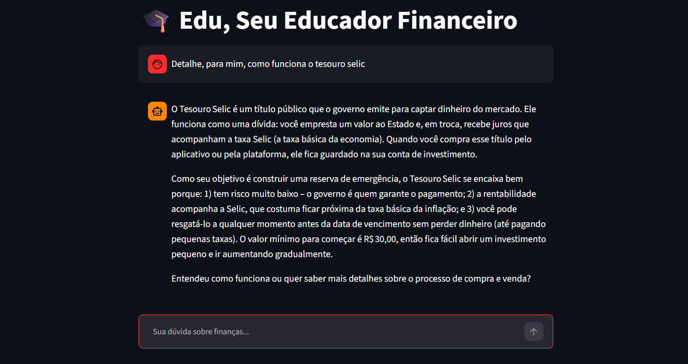

# Passo a Passo de Execução

## Setup do Ollama (5 minutos)
```bash
# 1. instalar Ollama (ollama.com)
# 2. Baixar um modelo leve ollama pull gpt-oss
# 3. Testar ollama run gpt-oss "Olá!"
```
## Estrutura do Projeto
```
src/
├── app.py              # Aplicação principal (Streamlit)
├── image.png           # Evidência de execução
```

## Código Completo

Todo o códigog-fonte está no arquivo `app.py`.

## Como Rodar
```bash
# 1. Instalar dependências
pip install streamlit pandas requests

# 2. Garantir que o Ollama está rodando
ollama serve

# 3. Rodar a aplicação
streamlit run .\src\app.py
```

## Evidência de Execução

